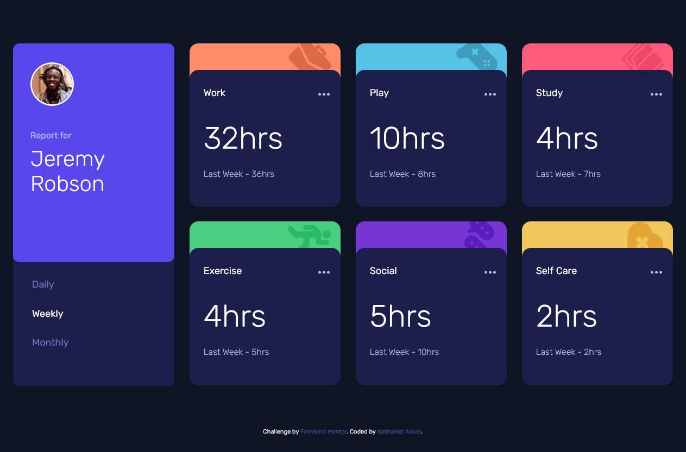

# Frontend Mentor - Time tracking dashboard solution

This is a solution to the [Time tracking dashboard challenge on Frontend Mentor](https://www.frontendmentor.io/challenges/time-tracking-dashboard-UIQ7167Jw). Frontend Mentor challenges help you improve your coding skills by building realistic projects. 

## Table of contents

- [Overview](#overview)
  - [The challenge](#the-challenge)
  - [Screenshot](#screenshot)
  - [Links](#links)
- [My process](#my-process)
  - [Built with](#built-with)
  - [What I learned](#what-i-learned)
  - [Continued development](#continued-development)
  - [Useful resources](#useful-resources)
- [Author](#author)
- [Acknowledgments](#acknowledgments)


## Overview

### The challenge

Users should be able to:

- View the optimal layout for the site depending on their device's screen size
- See hover states for all interactive elements on the page
- Switch between viewing Daily, Weekly, and Monthly stats

### Screenshot




### Links

- Solution URL: [Solution code](https://github.com/nathanieladiah/time-tracker)
- Live Site URL: [Solution site](https://nathanieladiah.github.io/time-tracker)

## My process

### Built with

- Semantic HTML5 markup
- CSS custom properties
- Flexbox
- CSS Grid
- Mobile-first workflow

I first created the markup and styling for the mobile version of the site. Then added styling for the desktop version, 
using sass mixins to adjust the CSS at different sizes.

Then I used JavaScript to dynamically display the data on the page by reading it from the JSON file.

### What I learned

I used SASS for writing the styles

I added a mixin for responsiveness:

```scss
  $breakpoints-up: ("medium": "40em", "large": "64em", "xlarge": "87.5em");

  @mixin breakpoint-up($size){
    @media (min-width: map-get($breakpoints-up, $size)) {
      @content;
    }
  }
```

I used the mixins to add different styles at the larger screen sizes, for instance changing to a grid layout 
once on the desktop version of the site:

```scss
  .page-container {
    margin-bottom: 5rem;

    @include breakpoint-up(large){
      display: grid;
      grid-template-columns: 1fr 3fr;
      grid-template-rows: 1fr 1fr;
      gap: 1.75rem;
      align-items: stretch;
      grid-template-areas: 
      "prof timecards"
      "prof timecards";
    }

    ...

  }
```

I had to learn how to use the `fetch` api:

* the first `.then` method converts the JSON into an object that can be used in JavaScript
* the second `.then` is where the actual processing of the data occurs, in this case
it calls a function called `populateTimes()` with the data object as its parameter

```js
fetch('data.json')
		.then(response => response.json())
		.then(data => {
			populateTimes(data);
		})
		.catch(error => {
			console.log(error);
		});
```

I added a switch statement in `populateTimes` to add an appropriate lead in to the hours depending 
on what timeframe was selected

```js
		switch (timeframe) {
			case 'daily':
				previous = 'Yesterday - ';
				break;
			case 'weekly':
				previous = 'Last Week - ';
				break;
			case 'monthly':
				previous = 'Last Month - ';
				break;
		}
```

### Continued development

I want to continue learning CSS grid and sass. I'm not entirely comfortable with laying out elements inside the grid; 
for instance making them take up all the space in a grid. 

I'd also like to add different breakpoints for changing the layout at sizes other than just small and large. 
Also, I think I should be using more variables and reusing some code in the scss files.

### Useful resources

- [CSS-Tricks: A Complete Guide to Grid](https://css-tricks.com/snippets/css/complete-guide-grid/) - 
This is a great resource for seeing all the CSS grid properties and options visually.

- [CSS-Tricks: The Holy Grail Layout](https://css-tricks.com/the-holy-grail-layout-with-css-grid/) -
An example of applying grid layout to a useful website layout.

- [MDN Web Docs: Working with Json](https://developer.mozilla.org/en-US/docs/Learn/JavaScript/Objects/JSON) - 
This shows how to access and manipulate JSON data using `XMLHttpRequest`.

- [How to Fetch and Display JSON Data](https://howtocreateapps.com/fetch-and-display-json-html-javascript/) - 
Displays the `fetch` api. I applied the `fetch` here to the examples from the above link.


## Author

- Website - [Nathaniel Adiah](https://nathanieladiah.github.io)
- Frontend Mentor - [@nathanieladiah](https://www.frontendmentor.io/profile/nathanieladiah)
- Twitter - [@nathanieladiah](https://www.twitter.com/nathanieladiah)


## Acknowledgments

I watched [this video](https://www.youtube.com/watch?v=aoQ6S1a32j8) and was introduced to the Frontend Mentor website. 
I also used the scss techniques shown in this video in my project.

So shout out to [Jessica Chan](https://twitter.com/thecodercoder), go check out some of her [videos]( https://www.youtube.com/thecodercoder)